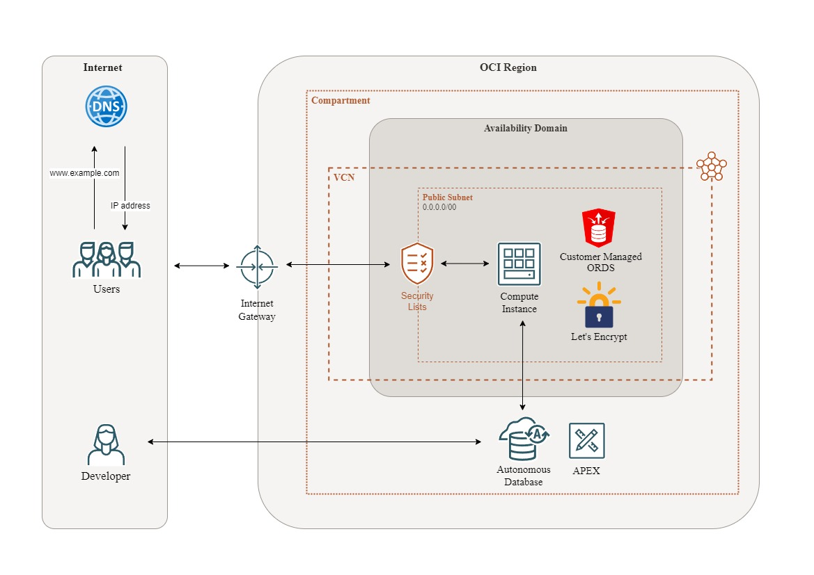

# Scenario 2

The architecture includes:
- **Oracle Autonomous Database (ADB)** with Oracle APEX enabled
- **Oracle REST Data Services (ORDS)** for exposing APEX applications and APIs

- **Custom Domain** & SSL/TLS configuration for secure access



## Notes

Please note that the following points are not intended as a step-by-step guide but rather a collection of helpful reminders to refer to as needed.

## Step 0 - Basic Setup

See notes [here](./basic_setup.md).

## Step 1 - Configure firewall

Allow and forward incoming traffic.

```
sudo firewall-cmd --permanent --add-port=8443/tcp
sudo firewall-cmd --permanent --add-forward-port=port=443:proto=tcp:toport=8443
sudo firewall-cmd --reload
```

## Step 2 - Install ORDS

Install ORDS from the repositories.

```
sudo dnf install -y ords
```

**NOTE**. The package creates the ```oracle``` user and puts the installation and configuration under the oracle ownership.

## Step 3 - Upload wallet

Copy the wallet to the instance.

```
scp -i <path>\<key> <path>\<wallet> opc@<ip>:/tmp
```

Move the wallet and set right permissions.

```
sudo mv /tmp/<wallet> /opt/oracle

sudo chown oracle:oinstall /opt/oracle/<wallet>
```

## Step 4 - Generate SSL certificate

Enable the EPEL repository.

```
sudo dnf install -y oracle-epel-release-el8
sudo dnf config-manager --set-enabled ol8_developer_EPEL
sudo dnf update -y
```

Install ```CertBot```.

```
sudo dnf install -y certbot
```

Run ```CertBot``` to obtain a SSL certificate.

**NOTE.** Replace ```<my_domain>```.

```
sudo certbot certonly -d <my_domain> --key-type rsa
```

Copy files.

**NOTE.** Replace ```<my_domain>```.

```
sudo mkdir /etc/pki/ords

sudo chown -R oracle:oinstall /etc/pki/ords/   

sudo cp /etc/letsencrypt/live/<mydomain>/fullchain.pem /etc/pki/ords
sudo cp /etc/letsencrypt/live/<mydomain>/privkey.pem /etc/pki/ords

sudo chmod 644 /etc/pki/ords/fullchain.pem
sudo chmod 644 /etc/pki/ords/privkey.pem
```

## Step 5 - Configure ORDS

Switch the current user.

```
sudo su - oracle
```

Start the ORDS configuration process. 

```
ords install adb --interactive --prompt-password
```

Enter the parameters.

**NOTE.** Replace ```<my_password>```.

```
Enter the Autonomous Database Wallet path: <wallet_path>
Enter a number to select the TNS Network alias to use: 1
Enter the administrator username [ADMIN]: ADMIN
Enter the database password for ADMIN: <my_password>
Enter the ORDS runtime database username [ORDS_PUBLIC_USER2]: ORDS_PUBLIC_USER2
Enter the database password for ORDS_PUBLIC_USER2: <my_password>
Enter the PL/SQL Gateway database username: ORDS_PLSQL_GATEWAY2
Enter the database password for ORDS_PLSQL_GATEWAY2: <my_password>
Enter a number to select additional feature(s) to enable: 1
Enter a number to configure and start ORDS in standalone mode: 1
Enter a number to select the protocol: 2
Enter the HTTPS port [8443]: 8443
Enter a number to select the certificate type: 2
Enter the path for the SSL Certificate: /etc/pki/ords/fullchain.pem
Enter the path for the SSL Certificates private key: /etc/pki/ords/privkey.pem
```

## Step 6 - Setup ORDS to start automatically

Setup ORDS to start automatically on boot.

```
sudo systemctl start ords
sudo systemctl enable ords
```